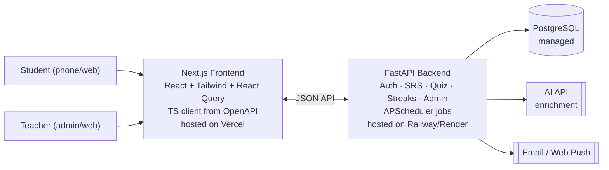
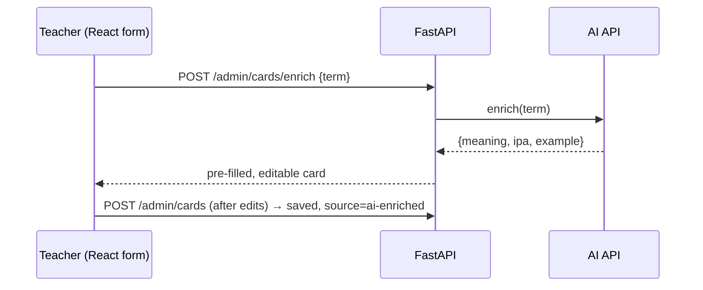
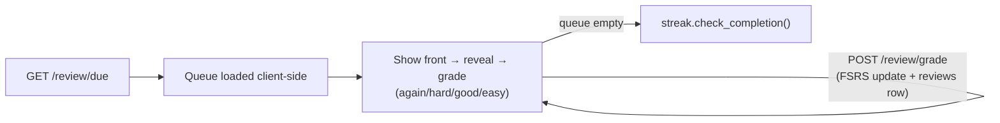

# Architecture — LinguaLoop (Language Learning App)

**Scope:** Phase 1 architecture + Phase 2 extension points · **Scale:** ~12 students, 1 teacher
**Stack:** Next.js (React/TS/Tailwind) frontend ↔ FastAPI (Python) JSON API ↔ PostgreSQL

## 1. Principles

- **Boring, cheap, single-developer friendly.** Optimize for shipping/maintaining alone, not scale you don't have.
- **Clean split.** React owns UI; FastAPI owns data, SRS, auth, jobs — talk over HTTP/JSON.
- **Contract-first.** FastAPI's OpenAPI schema generates a typed TS client, so frontend/backend never drift.
- **Managed everything.** Managed DB + simple hosts; no infra to run. Don't hand-roll SRS — use FSRS.
- **Future-proof the data model** (multi-language, etc.) but build only English + Phase 1.

## 2. System Context



Two deployables, communicating via a CORS + token-secured JSON API. All external dependencies are managed services — no self-hosted infra.

## 3. Stack Choices

| Layer | Choice | Why |
|---|---|---|
| Frontend framework | Next.js (App Router, TS) | File-based routing, easy deploy |
| Styling / data | Tailwind + TanStack Query | Mobile-first styling; caching & loading states |
| API client | Generated TS client from OpenAPI | Types stay in sync automatically |
| UI components | shadcn/ui / Radix on Tailwind | Accessible, fast to build card/quiz UI |
| Backend | FastAPI + SQLAlchemy 2.0 + Alembic | Async, auto OpenAPI, standard migrations |
| Database | PostgreSQL (Supabase/Neon/Railway) | Reliable, free at this scale |
| SRS | `py-fsrs` | Modern spacing algorithm, better than SM-2 |
| Auth | JWT or shared-domain session cookies + argon2 | Works cross-origin; teacher creates accounts |
| Jobs | APScheduler (in-process) | Daily reminders/rollover — no Celery/Redis needed |
| Email / Push | Resend/Postmark/SES; `pywebpush` (optional) | Reliable reminders |
| Hosting | Vercel (frontend), Railway/Render/Fly + Docker (backend) | Cheap, managed TLS |

> **Auth note:** frontend/backend are different origins — pick JWT (access + httpOnly refresh cookie) or shared-parent-domain session cookies. CORS restricted to the frontend origin.

## 4. App Structure

```
backend/                       frontend/
├── main.py  (routes, CORS)    ├── app/(student)/review|quiz
├── models/, schemas/          ├── app/(admin)/dashboard|decks
├── auth/                      ├── components/ (Tailwind + shadcn/ui)
├── vocab/ (+ enrichment.py)   ├── lib/api/ (generated TS client)
├── srs/  (FSRS wrapper)       ├── lib/auth/
├── quiz/, streaks/, admin/    └── hooks/ (useDueCards, useGradeCard...)
└── jobs/ (APScheduler)
```

Domain-separated backend modules so Phase 2 (exams, quests, library) bolt on as new packages. Monorepo keeps generated types easy to refresh.

## 5. Data Model (Phase 1)

All tables have `id`, `created_at`, `updated_at`.

| Table | Key fields |
|---|---|
| **users** | email, password_hash, role (`admin`/`student`), timezone, daily_new_target |
| **languages** | code, name — future-proofing; seed with `en` |
| **decks** | owner_id, language_id, name, exam_tag, topic_tags |
| **cards** | deck_id, term, meaning, ipa, example_sentence, image/audio_url, source |
| **assignments** | student_id, deck_id, daily_new_target override, active |
| **card_states** | student_id, card_id (unique pair), state, FSRS fields (stability, difficulty, due_at, reps, lapses) |
| **reviews** | student_id, card_id, rating, reviewed_at, source — immutable log |
| **streaks** | student_id, current/longest_streak, last_completed_date, freezes_remaining |
| **quiz_sessions** | student_id, started/finished_at, score, question_count |

> **Key design note:** SRS state lives in `card_states`, keyed per **student** — the same teacher-authored deck schedules independently for each of the 12 students.

## 6. Key Flows

**Add-vocab with AI enrichment** (the make-or-break flow — single round trip, always editable, never auto-saves):



**Daily review loop** (student):

Optimistic UI: cards advance instantly, grades POST in the background.

**Quiz:** `quiz.generate()` builds MCQ + type-answer from due/known cards (MCQ distractors from same deck); wrong answers call `srs.grade(again)` to reschedule sooner.

**Streaks/reminders (background):** APScheduler runs per student timezone — rolls streak day boundary (applies freeze if missed), sends reminder if due cards are outstanding.

**Admin dashboard:** aggregate queries over `reviews` + `card_states` + `streaks` → per-student streak/last-active/due/accuracy, a "who's slipping" view, and per-deck completion %.

## 7. Security & Privacy

- Roles enforced **server-side only** — frontend just hides UI, API enforces it.
- CORS locked to known frontend origin(s); HTTPS everywhere.
- Passwords via argon2; short-lived JWT + httpOnly refresh, or session cookies.
- Student data private to teacher + that student — no cross-student visibility.
- Minors: minimal PII, no ad/tracking SDKs, easy export/delete; consider parent email for younger students.
- AI calls send only the term — no student PII. Secrets via env vars only.

## 8. Deployment & Ops

- **Envs:** local (SQLite/dev Postgres) → prod (managed Postgres + backend container + Vercel).
- **CI/CD:** push to `main` → backend Docker deploy (Alembic migrations on release) + Vercel auto-deploy with PR previews. Regenerate TS client whenever backend schemas change.
- **Backups:** managed Postgres automated backups (verify enabled). **Monitoring:** host logs + UptimeRobot + Sentry free tier.
- **Cost:** free/low tiers comfortably cover 12 users + modest AI usage.

## 9. Non-Functional Targets

Right-sized for 12 users: no load-scaling work, review interactions feel instant (optimistic UI), AI enrichment latency of a couple seconds is fine, "good enough" availability, managed-backup durability is sufficient. **Not** engineered for scale/HA/multi-region — revisit only if Phase 2 goes multi-teacher.

## 10. Phase 2 Extension Points

- **Mock exams** → new `exams/` package, reuses cards/reviews.
- **Quests** → new `quests/` package reading `reviews`/`card_states`.
- **Content library** → new `library/` package + object storage.
- **Reading-to-vocab** → extends `enrichment.py` to parse passages.
- **Multi-language** → already modeled via `languages`/`decks.language_id`.
- **Native mobile/PWA** → wrap Next.js as PWA or port to React Native, same API.
- **Scale** → move APScheduler → Celery+Redis, add caching, only if usage grows an order of magnitude.

---
*Trades scalability for solo-dev simplicity and speed — sized for ~12 users, structured so Phase 2 is additive.*
