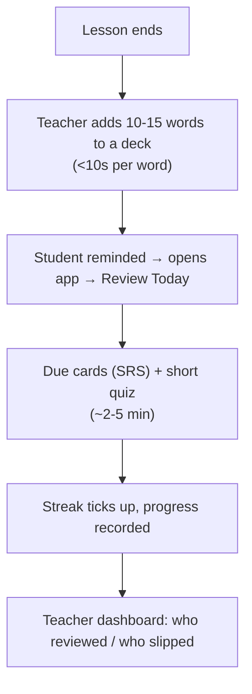

# Scope of Work — Language Learning App (Phase 1)

**Owner/Admin:** Verzol · ~12 students, teacher-curated English learning

## 1. Vision

A web app where students study English **between lessons** while the teacher controls *what* they practice and *sees whether they did it*. Not a generic flashcard tool — the teacher curates content around a **specific target exam**, so every student practises the right words in the right order.

**Core belief:** the hard problem is behavioural, not educational. SRS is a solved commodity; getting a dozen teens to show up daily without the teacher in the room is the real product. Phase 1 nails one tight daily loop, not a broad feature set.

## 2. Users & Roles

| Role                    | Who          | Job-to-be-done                                                  |
| ----------------------- | ------------ | --------------------------------------------------------------- |
| **Student**       | ~12 learners | "Tell me what to review today, let me finish in a few minutes." |
| **Admin/Teacher** | Verzol       | "Push the right content to each student, see who's keeping up." |

Students **self-register** (public signup → always a `student`); the teacher no
longer provisions every account. "Being in a class" is still teacher-controlled —
membership means the teacher has assigned you their decks — and a self-registered
student can also author **their own personal vocab** to study alongside class
decks. (This revises the original "no self-signup" call; see the note under §5.)

## 3. The Core Loop

Every feature below exists to serve this loop; anything that doesn't is deferred.

## 4. Phase 1 Scope

- **Vocabulary & SRS (student):** "Review Today" shows only due cards, one at a time (term, meaning, IPA, example, optional image/audio). Grading (Again/Hard/Good/Easy) drives an **FSRS** scheduler. States: new/learning/review/lapsed.
- **Add/manage vocab (admin):** create decks, fast-add flow (type/paste word → AI-suggested definition/IPA/example → teacher reviews/edits → save, **<10s/word**), bulk paste-a-list enrichment, edit/delete/move cards, tag decks by exam + topic.
- **Assignment & curriculum control:** assign decks to a student or the whole class; set daily new-card target per student or globally; students only see assigned decks.
- **Quizzes:** short auto-generated quiz from due/known cards; at least MCQ + type-the-answer; wrong answers reschedule sooner via the SRS scheduler.
- **Timer/session control:** optional per-session timer or daily study-minutes goal; soft cap so sessions end cleanly.
- **Streaks & reminders:** daily streak counter, tunable freeze/grace handling, daily email and/or web-push reminder.
- **Admin dashboard:** per-student streak/last-active/due/reviewed-this-week/accuracy; a "who's slipping" view (no activity in N days); per-deck progress.
- **Accounts:** teacher-created student accounts, simple login (email+password or magic link), single elevated admin account, all student data private to teacher + that student.

## 5. Out of Scope for Phase 1

Deferred deliberately, not forgotten:

- Document/content library (use a shared folder/linked page instead)
- Full mock-exam simulator, quest generation
- ~~Public sign-up~~ / multi-teacher support — **public self-signup was pulled into scope** (see §2). Multi-teacher support stays deferred. The hardening once owed on the signup path (**email verification** and **rate limiting**) shipped in M7 (§7), together with **Google sign-in**
- Native iOS/Android apps (PWA install prompt only)
- Gamification beyond streaks (no leaderboards/XP/badges)
- Payments/monetization
- Multi-language content (English only; data model just shouldn't block it later)

## 6. Success Criteria

1. Teacher adds a fully-enriched word in <10s and assigns a deck.
2. Student completes due reviews + quiz in a few minutes; streak updates.
3. Reminders fire reliably, once a day.
4. Teacher's dashboard correctly shows who has/hasn't studied this week.
5. Survives real use by all ~12 students for 4 consecutive weeks, no hand-holding.

**Primary metric:** weekly active students / total students (retention).

## 7. Delivery Milestones

| #  | Milestone                       | Outcome                                               |
| -- | ------------------------------- | ----------------------------------------------------- |
| M1 | Foundations                     | Accounts, login, data model, one viewable deck        |
| M2 | SRS review loop                 | "Review Today" works end-to-end (FSRS)                |
| M3 | Admin add-vocab + AI enrichment | Fast add/enrich + deck assignment                     |
| M4 | Quizzes + timers                | Quiz types feed the scheduler                         |
| M5 | Streaks + reminders             | Daily streak + email/push live                        |
| M6 | Admin dashboard                 | Progress + "who's slipping"; pilot with real students |
| M7 | Launch hardening + accounts     | Rate limiting, token revocation, secret guard, CI; email verification + Google sign-in |

M1–M6 close out Phase 1 as originally scoped. **M7** is post-Phase-1 work added
once self-signup went public: it makes the signup path safe to expose (see §5),
and is what `docs/SETUP_TODO.md` asks you to finish configuring.

## 8. Phase 2 Backlog (unscoped)

Mock exam simulator · quest generation · document/content library · reading-to-vocab pipeline · richer gamification (XP/badges/leaderboard) · listening/speaking practice · multi-language support · native mobile/full PWA offline · parent/progress-sharing reports.

## 9. Key Risks

| Risk                                   | Why it matters                            | Mitigation                                                                      |
| -------------------------------------- | ----------------------------------------- | ------------------------------------------------------------------------------- |
| Students won't self-study consistently | Whole outcome depends on unsupervised use | Tiny daily loop; streaks, reminders, teacher visibility substitute for presence |
| Teacher stops adding words (tedious)   | Content dries up → app dies              | Obsess over <10s add flow; AI enrichment is core                                |
| AI definitions/examples wrong          | Bad content undermines trust              | Teacher always reviews before saving; nothing auto-publishes                    |
| Over-building (library, mock exams)    | Classic side-project death                | Enforce the "Not Now" list (§5)                                                |
| Reminders don't land                   | No nudge → no habit                      | Start with email (reliable); web push is enhancement only                       |

---

*Defines Phase 1 scope to prevent scope-creep. Anything not in §4 goes to the Phase 2 backlog (§8), not into Phase 1.*
